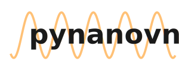

<picture>
  <source srcset="logo_light.svg" media="(prefers-color-scheme: dark)">
  <source srcset="logo_dark.svg" media="(prefers-color-scheme: light)">
  
</picture>


[](https://pepy.tech/projects/pynanovna)
[](https://pepy.tech/projects/pynanovna)

[](https://doi.org/10.5281/zenodo.14231110)


This is a Python module for NanoVNA.


## 🌟 Features
    ✅ Supporting almost all NanoVNAs.
    📶 Run single sweeps of s11 & s21 data.
    🔄 Stream continuous sweeps.
    🛠️ Calibrate your NanoVNA.
    📊 Interactive, real-time plots of data.
    📁 Record to CSV files.


## 🛠️ Installation
Install with `pip install pynanovna`.

## 🚀 Example
```
import pynanovna

vna = pynanovna.VNA()

vna.set_sweep(1.0e9, 1.4e9, 101)

stream = vna.stream()
for s11, s21, frequencies in stream:
    print(s11, s21, frequencies)
```

See `examples/example.py` for a more detailed example on some use cases of the project.

See `examples/example_calibration.py` for details on how to calibrate you NanoVNA.

## 📚 API Reference
API Reference is available at [pynanovna.readthedocs.io](https://pynanovna.readthedocs.io/en/latest)

## 📖 Cite This Library

If you use *pynanovna* in your research or project, please cite it as follows:

**BibTeX**
```bibtex
@software{pynanovna,
  author = {PICC-Group, Teo Bergkvist},
  title = {pynanovna: A Python Module for NanoVNA},
  year = {2024},
  url = {https://github.com/PICC-Group/pynanovna},
  version = {1.0.2},
  doi = {10.5281/zenodo.14231111},
}
```
## 📜 Licence
*pynanovna* is under GNU General Public License.

## Contribution and feature requests
If you want to contribute to *pynanovna*, please create a pull request and assign to:
- [@tbergkvist](https://github.com/tbergkvist)
- [@OdoctorG](https://github.com/OdoctorG)

If you have a feature you think is missing and want implemented, create an issue with the `enhancement` label, describing clearly the feature.

## 🕰️ History
Originally this was the fork [nanovna-saver-headless](https://github.com/PICC-Group/nanovna-saver-headless) from [nanovna-saver](https://github.com/NanoVNA-Saver/nanovna-saver) but when that project no longer shared much code with the original we decided to create a new project.

# ⭐️ If you find *pynanovna* useful, please support us by starring the repository ⭐️
